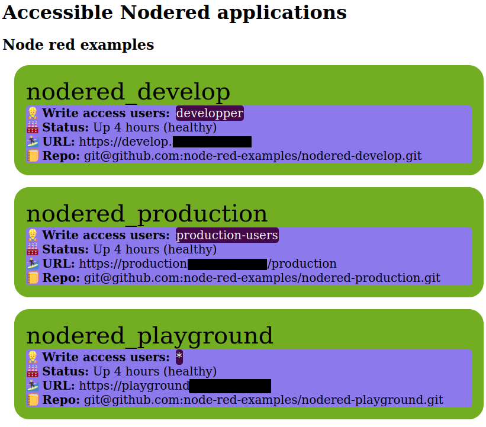

# Node-REDs with an S

A how-to or template for managing several node red services using git-based project

NB: THIS WORK IS STILL IN PROGRESS

## Introduction

If you're looking for an open-source platform:

- where several people can work together on low-code projects,
- where these projects don't step on each other (no side effects!),
- where these projects have version control,
- where authentication & authorization is implemented so that not anybody can mess with production-ready code,
- and where you can monitor all of these,

then you landed on the right page!

## Overview

These are the tools used here (work in progress if unchecked):

- [X] [Node-RED](https://github.com/Node-RED/Node-RED-docker) is used for our low code development platforms (with an S!). It has a large range of modules compatible with most data entries, including the most modern & standard APIs (Rest, MQTT, OPC-UA), or [legacy industrial APIs of old school PLC (Mitsubishi, Allen Bradley, Omron, Siemens, etc)](https://flows.nodered.org/search?term=PLC&type=node). Most importantly, it takes little effort to have code running in production: no DevOps required!
- [X] [FastAPI](https://github.com/tiangolo/fastapi) is used to make a very simple landing page showing you available Node-RED instances. Flask could be a good alternative to FastAPI.
- [X] [Keycloak](https://github.com/keycloak) is used to manage users. It is compatible with common identity providers such as Microsoft Azure Active Directory or Google.
- [X] [Traefik](https://github.com/traefik/traefik) is proxying the various services over TLS thanks to Let's Encrypt
- [ ] [Grafana & Prometheus stack](https://github.com/vegasbrianc/prometheus) for monitoring everything

These services will all be running on docker, so almost everything you need is code.

## Prerequisite

This stack is tested on the following configuration, but similar setups may work:

**Mandatory:**

- Debian-like systems:
  - Debian 11 (note for 10, you'll need to update `jsonpointer` to version >=2)
  - or Ubuntu 20.04
- `docker` version 20.10.17
- `docker compose` 2.6.0 (note the lack of dash)
- a domain name directing to your host, although you may make it work on debian/ubuntu with self-signed certificates & proper configuration (topic unaddressed here)

**Optional:**

- `gh` or GitHub CLI, see [instructions for installing](https://github.com/cli/cli#installation) ([linux](https://github.com/cli/cli/blob/trunk/docs/install_linux.md)). This is necessary for creating on the fly the repositories required by new NodeRed projects on Github.

## Getting started

This repository may run as is, although it is meant to be modified to fit your use case. Environmental variables are used for critical information (like the domain name). However some intrinsic passwords of some backends will need to be updated. Review them in each `compose.yaml` file.

Here are the steps you will need to follow for this example Node-RED stack to function:

1. create an `.env` file
2. start traefik
3. create a `nodered` Realm in Keycloak
4. initialize Node-RED
5. start working


### create an `.env` file

Several key environmental values need to be added for this project to work. You can copy the template with `cp template.env .env` and fill it out.

Two important keys are:

- `DOMAINNAME`: your domaine name, e.g. example.com
- `DOMAINEMAIL`: email address you will use for [Let's Encrypt](https://letsencrypt.org)

### Start traefik

As simple as:

```sh
set -a
. .env
set +a
docker compose -f ./traefik/compose.yaml up -d
```

You should then be able to access `traefik.${DOMAINNAME}` using the password you've set up in the environment file as well as `index.${DOMAINNAME}` which should, for now, show almost nothing.

### create a `nodered` Realm in Keycloak

First start keycloak:

```sh
docker compose -f ./keycloak/compose.yaml up -d
```

then access keycloak (url: https://keycloak.${DOMAINNAME}) and log in with the admin user you've entered in the `.env` file.

Hover on `master` on the top left, there should be a pre-configured `nodered` realm with a `nodered` client and roles.

Find the credential secret of the `nodered` client and add it to your `.env` file for `KEYCLOAK_NODERED_CLIENT_SECRET`.

please refer to Keycloak documentation if you want to connect this realm to your identity providers (Microsoft, Github, etc).

### initialize the Node-RED instances

Review the [Node-REDs compose file](node-reds/compose.yaml) and adapt to your situation. You can leave it as is to create three containers: one for all (playground), one for developpers only (develop), and one for production users (production).

Simply run `./node-reds/init_and_run.sh`. This will

- export your environment variables
- attach an ssh agent with access to the git host you've selected
- build and start the Node-RED containers you configured.
- if you use github and the corresponding repository do not exist, it will create them using `gh`
- if you don't use github or haven't configured `gh`, you will need to add the repository manualy for each Node-RED image. Each repository must be exactly named as the image.
- it will clone the corresponding repositories in each container
- if not yet set up, it will ask for a node red secret add to your project. This is necessary to encrypt all credentials as they will be saved on the repository.

### Start working

At this point, `index.${DOMAINNAME}` should show you the list of all node red instances, their health, who may access it, and with which repo it is connected with.


Clicking on a box should direct you to the Node-RED instance.
You can start working on your flows [AND use version control with git](https://nodered.org/docs/user-guide/projects/)! If all goes well, you should be able to push your commits using the `Projects` module of Node-RED without configuring an SSH key as all Node-RED instances will be using your host's agent.

On first log in, it will require to load the first project files and to retype your Node-RED credential secret.

<!-- Then you can run:

```sh
set -a
. .env
set +a
docker compose -f ./<service>/compose.yaml up -d #execute as many times as needed
```

Where `<service>` are the folders containing available docker micro services. -->
